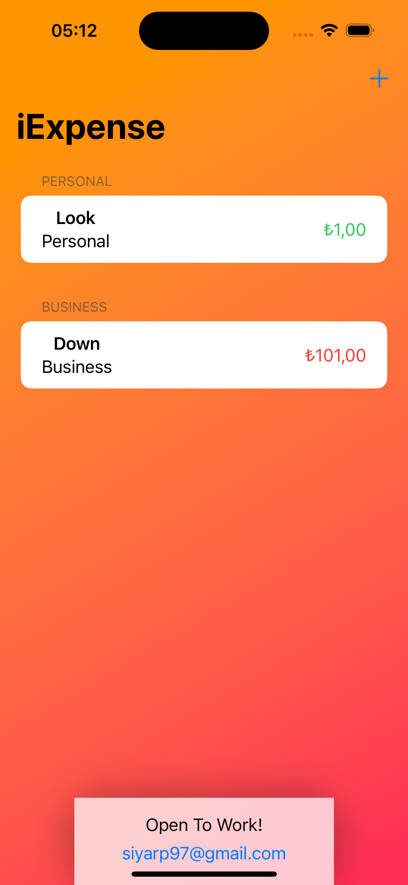

<!-- Improved compatibility of back to top link: See: https://github.com/othneildrew/Best-README-Template/pull/73 -->

<!--
*** Thanks for checking out the Best-README-Template. If you have a suggestion
*** that would make this better, please fork the repo and create a pull request
*** or simply open an issue with the tag "enhancement".
*** Don't forget to give the project a star!
*** Thanks again! Now go create something AMAZING! :D
-->

<!-- PROJECT SHIELDS -->
<!--
*** I'm using markdown "reference style" links for readability.
*** Reference links are enclosed in brackets [ ] instead of parentheses ( ).
*** See the bottom of this document for the declaration of the reference variables
*** for contributors-url, forks-url, etc. This is an optional, concise syntax you may use.
*** https://www.markdownguide.org/basic-syntax/#reference-style-links
-->

[![LinkedIn][linkedin-shield]][linkedin-url][![instagran][instagram-shield]][instagram-url][![twitter][twitter-shield]][twitter-url]
 
[![Gmail][Gmail-shield]](mailto:siyarp97@gmail.com)

<!-- PROJECT LOGO -->
 

<h3 align="center">iExpense</h3>
 

    Hacking With Swift - 100 Days of SwiftUI Milestone Challenge
 

    <a href="https://www.hackingwithswift.com/100/swiftui/38"><strong>Go to HWS page -></strong></a>

<!-- ABOUT THE PROJECT -->
## About The Project

 

Who doesn't want to track myself? Especially when we talk about the money.. iExpense is that kind of app. Off topic but I'm tired therefore wouldn't upload a GIF.
So I'm newbie and that's code by building with my Swifty way.
I am new about the Swift world, if you want to contact me <strong>please send a mail or follow from my social media!</strong>

(<a href="#readme-top">back to top</a>)

### Built With

* [![Swift][Swift]][Swift-url]
* [![SwiftUI][SwiftUI]][SwiftUI-url]

(<a href="#readme-top">back to top</a>)

<!-- USAGE EXAMPLES -->
## Usage
Just clone and look up!
May we are at the same way through this adventure. Check my codes and improve together. Any feedbacks are welcome.

(<a href="#readme-top">back to top</a>)

<!-- CONTACT -->
## Contact

Şiyar Palabıyık - siyarp97@gmail.com

(<a href="#readme-top">back to top</a>)

<!-- MARKDOWN LINKS & IMAGES -->
<!-- https://www.markdownguide.org/basic-syntax/#reference-style-links -->
[Gmail-shield]: https://img.shields.io/badge/Send-grey?style=for-the-badge&logo=gmail&&logoColor=red

[linkedin-shield]: https://img.shields.io/badge/Follow-blue?style=for-the-badge&logo=linkedin&&logoColor=fff
[linkedin-url]: https://www.linkedin.com/in/siyarpalabiyik/
[twitter-shield]:https://img.shields.io/badge/Follow-black?style=for-the-badge&logo=x&&logoColor=fff
[twitter-url]: https://x.com/siyarpalabiyik
[instagram-shield]:https://img.shields.io/badge/Follow-red?style=for-the-badge&logo=instagram&&logoColor=fff
[instagram-url]: https://www.instagram.com/siyarpalabiyikk/
[product-screenshot]: https://media0.giphy.com/media/v1.Y2lkPTc5MGI3NjExZXM5aHVnb29maXlrN3JpZW1lZDY4OGp2dGo4Y2JnM2NpMnBrcDcycyZlcD12MV9pbnRlcm5hbF9naWZfYnlfaWQmY3Q9Zw/VCl5Lo7dIsSFv9kHHh/giphy.gif
[Swift]: https://img.shields.io/badge/Swift-orange?style=for-the-badge&logo=swift&&logoColor=fff
[Swift-url]: https://www.apple.com/tr/swift/
[SwiftUI]: https://img.shields.io/badge/Swift%20UI-blue?style=for-the-badge&logo=swift&&logoColor=fff
[SwiftUI-url]: https://developer.apple.com/xcode/swiftui/
